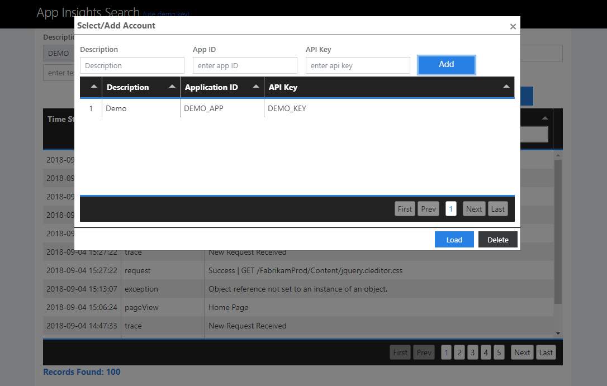
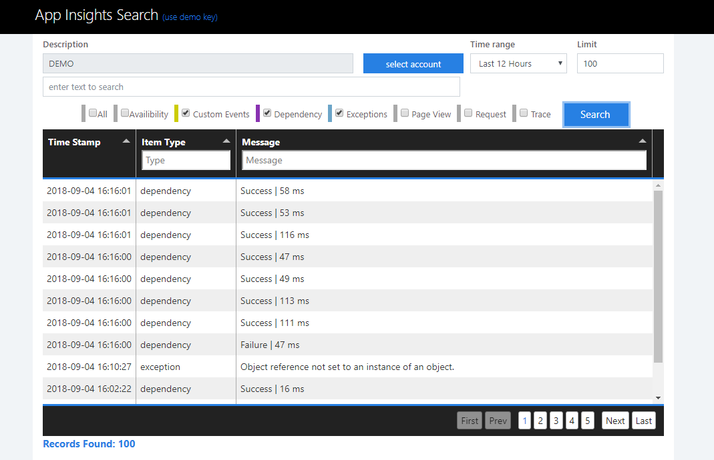

# azure-appinsights-search

A smart html tool for viewing your application instrumentation Data powered by Azure AppInsights. 

***Note:** Rest API retrieves data only using appid & apikey. instrument key cannot be used.*

## Introduction
This html app provides access to your web app instrumentation data powered by Azure AppInsights. 

Instrumentation data included ***Request, Exception, Trace, Dependency, Availability Sets, Page Views and Custom Events***.

## Demo
[click here for the demo](http://appinsightssearch.scm.azurewebsites.net)


### Installation

Package Manager
```
Install-Package AppInsights.Search -Version 1.0.0
```
.NET CLI
```
dotnet add package AppInsights.Search --version 1.0.0	
```

## How to use
* when you open the file ***app-insights-search.html*** it will load demo key for testing and you screen will be like the below screenshot


* when you click on the button ***select account*** following popup will come.


Here you can add ***Description, application ID and API key*** and click on add. It will then save this to your browser localstorage for further use.



* you can add multiple records here and when you have to select a specific key click on that key *(for selecting)* and then click on the load button on the bottom as shown in the image.


 it will show the Description of added key in the main page and starts searching for the selected key. As it finds out records it will populate table with the data by showing three columns ***TimeStamp,Item Type and the message***


* When you click on any row of a table it will show further details *(depending upon item type)* of the selected row as shown below.


### Other Functions

* Main page have the field named ***Time Range*** *(Default is 12 hours)* from where you can enter the time of which you want to see the records.

This ***Time Range*** field also have a option named ***custom***. When you select this two fields will be visible blow it where you can add the time range and this app will search for the events that occure in this time range.


* It have the field named ***Limit*** *(Default value is 100)* where you can add the number of records you want *e.g: 100,200.. etc*

* It have the field named ***enter text to search*** just below the description field where you can enter key word and this app will bring those records from the azure which have those keywords as shown below in the screenshot. 


* This app have the checkboxes which serves a user that which item type a user wants this app to search for.



## Authors

* [Umair Tariq](https://github.com/umairtarik) 
* [Hamza Safdar](https://github.com/hamzasafdar01)

See also the list of [contributors](https://github.com/umairtarik/azure-appinsights-search/contributors) who participated in this project.

## Built With

* [Jquery](https://jquery.com/) - cross-platform JavaScript Library 
* [Bootstrap v4](https://getbootstrap.com/) - Html Styling
* [Bootswatch](https://bootswatch.com/) - Boostrap based themes
* [Tabulator](http://tabulator.info/) - A lightweight, fully featured, interactive table jQuery plugin
* [Jquey UI Timepicker Addon](http://trentrichardson.com/examples/timepicker/) - Jquery UI based Timepicker Add-on 
* [Azure App Insights Rest API](https://dev.applicationinsights.io/) - Access all your app's event and metric data using powerful Rest API.

## Tags

appinsights, azure application insights, appinsights search, etc


